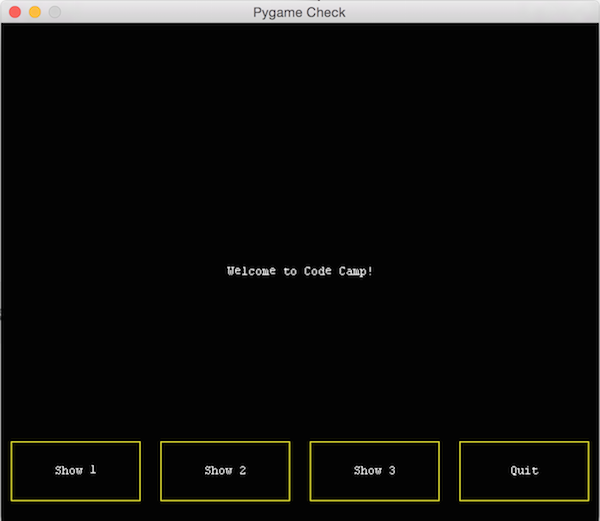

# Setup

You'll need Python and PyGame installed on your system to run and change the game.

For all of the files listed below, you should use one of the rookie kit thumb drives to save on network bandwidth.

## Windows/Mac OSX

1. Download and install the latest version of Python 2.7 (32-bit version).
  * Do not install a 3.x version of python
  * Do not install a 64-bit version of python (even if your operating system is 64-bit)
  * [Windows installer - Python](python-2.7.10.msi)
  * [OSX installer - Python](python-2.7.10-macosx10.6.pkg)
2. Download and install the 32-bit version of PyGame for Python 2.7
  * [Windows installer - PyGame](pygame-1.9.1.win32-py2.7.msi)
  * [OSX installer - PyGame](pygame-1.9.2pre-py2.7-macosx10.7.mpkg.zip)

*Note:* If you are running El Capitan or Sierra, it is suggested that you install python and pygame using homebrew.

To install homebrew:

1. Visit [brew.sh](http://brew.sh)
2. Copy the install command.
3. Open terminal (Finder > Go > Utlities > Terminal)
4. Paste the command and wait for homebrew to finish installing.

Once homebrew is installed you can install python and pygame using the commands below.

  brew update
  brew install python
  brew install homebrew/python/pygame

## Linux
1. Install python2.7 using the Package Manager.
2. Install pygame using the Package Manager.

## Test your system to verify python and pygame work.

* Download and run [pygame_check.py](pygame_check.py)
* If you see the following window with Code Camp messages, your system is working

